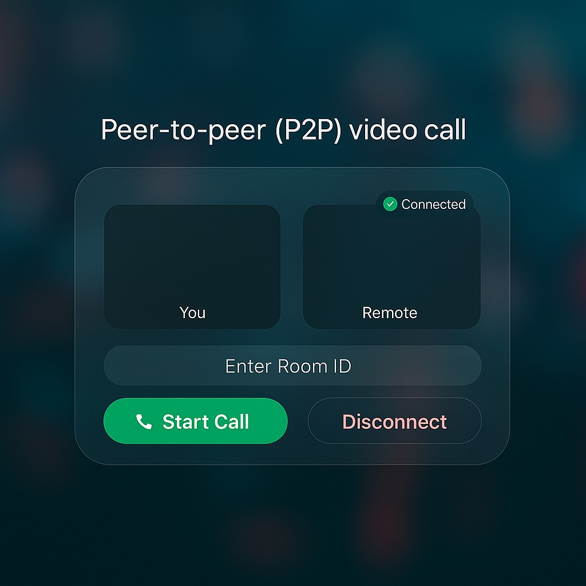

# 📞 Peer-to-Peer (P2P) Video Call Application

A **React-based real-time video calling app** that enables two users to connect directly using **WebRTC** with a **WebSocket signaling server**. The app supports video/audio streaming, text chat, and file sharing with a modern, glassmorphic UI.

---

## 🚀 Features

* 🎥 **P2P Video & Audio Call** – Direct connection using WebRTC.
* 💬 **Text Chat** – Send and receive messages during calls.
* 📂 **File Sharing** – Share files in chunks over DataChannel.
* ⏱ **Timer** – Auto disconnect if no user joins within 2 minutes.
* 🟢 **Status Indicator** – Shows `Connected`, `Waiting`, or `Disconnected`.
* 🎨 **Glassy Modern UI** – Responsive and minimal design.

---

## 🛠 Tech Stack

* **Frontend:** React.js, CSS (custom components)
* **Signaling:** WebSocket (Node.js/Express backend)
* **WebRTC APIs:** RTCPeerConnection, DataChannel, MediaStream
* **Icons:** React Icons

---

## 📂 Project Structure

```
src/
├── components/
│   ├── Header.js / Header.css
│   ├── StatusIndicator.js / StatusIndicator.css
│   ├── VideoGrid.js / VideoGrid.css
│   ├── RoomInput.js / RoomInput.css
│   ├── TimerProgress.js / TimerProgress.css
│   ├── ChatBox.js / ChatBox.css
│   ├── CallButtons.js / CallButtons.css
│
├── hooks/
│   ├── useCallManager.js   # Main call logic (WebRTC setup & signaling)
│   ├── useChat.js          # Handles chat messages via DataChannel
│   ├── useFileShare.js     # Handles file sending/receiving via DataChannel
│   ├── useTime.js          # Manages waiting/disconnect timer
│
├── utils/
│   ├── signaling.js        # WebSocket connection helper
│   ├── webrtc.js           # WebRTC peer setup, ICE handling
│
├── App.js                  # Root component, connects UI & logic
├── App.css                 # Global styles & glassmorphic layout
└── index.js                # React entry point
```

---

## ⚙️ Installation

1. Clone the repository:

```
https://github.com/Rohit175041/voip_server
cd voip_server
```

2. Install dependencies:

   ```bash
   npm install
   ```

3. Create `.env` file for custom configs (optional):

   ```env
   REACT_APP_SIGNALING_URL=wss://your-signaling-server/ws
   REACT_APP_ICE_SERVERS=stun:stun.l.google.com:19302
   ```

4. Start the app:

   ```bash
   npm start
   ```
---

## ⚙️ UI

<p align="center">
  
</p>

## 📡 How It Works

1. User enters a **Room ID** and clicks **Start Call**.
2. A **WebSocket connection** is created for signaling.
3. WebRTC handles:

   * SDP Offer/Answer exchange
   * ICE Candidate exchange
4. Once connected:

   * Video/Audio streams are shown
   * DataChannel allows chat & file transfer

---

## 🎨 UI Highlights

* **Glassy containers** with blur effects
* **Neon Start Call button** (green)
* **Soft coral Disconnect button** (pink/red)
* **Responsive layout** for mobile & desktop

---

## 🔮 Future Improvements

* 📱 video call (p2p)
* 🔐 End-to-end encryption for chat/files
* 🌐 Deploy signaling server on cloud (Render)

## 🌐 Project Links
- 🖥️ **Backend Repository:** [voip_server](https://github.com/Rohit175041/voip_server)
- 💻 **Frontend Repository:** [lan-voip](https://github.com/Rohit175041/lan-voip)
- 🚀 **Live Demo:** [lan-voip.onrender.com](https://lan-voip.onrender.com)

### 👨‍💻 Author

Developed by **Rohit Singh** ✨

